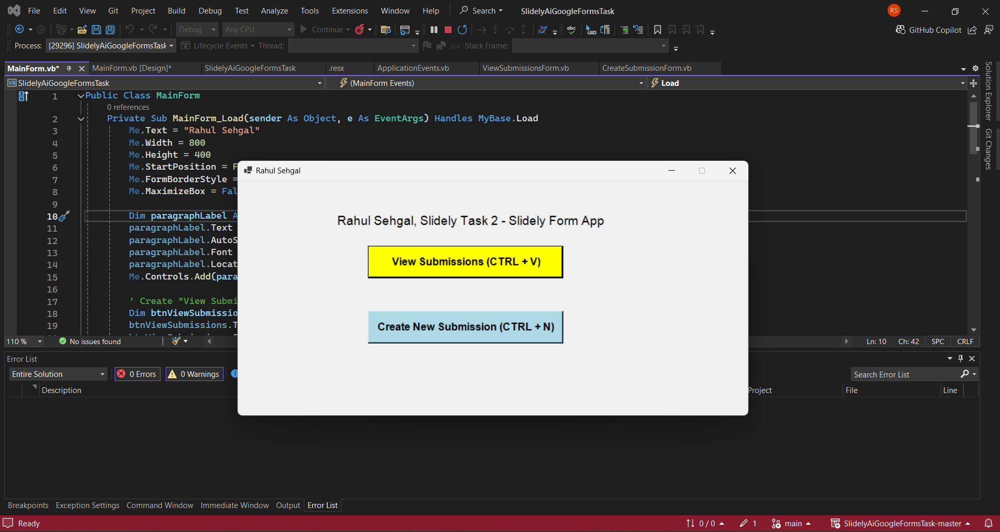
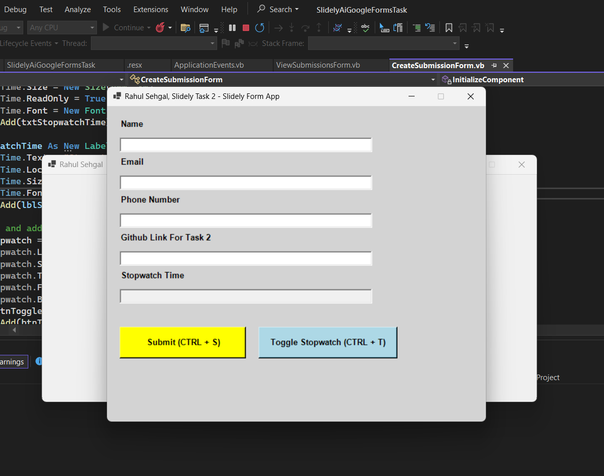
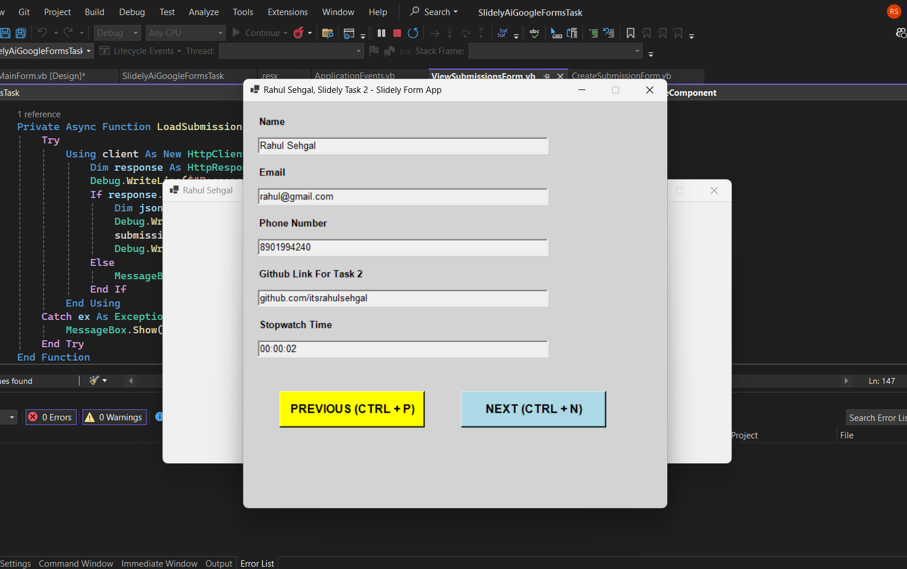

# Form Web App

Form Web App is a simple Windows Forms application built using VB.NET that allows users to create and submit forms with a stopwatch feature. This project is designed to demonstrate basic form handling, validation, and timer functionality.

## Features

- User can input their Name, Email, Phone number, and GitHub link.
- Stopwatch functionality to record the time taken to fill out the form.
- Submit button to save the user's input and display a confirmation message.
- Clear form fields after submission.

## Screenshots

